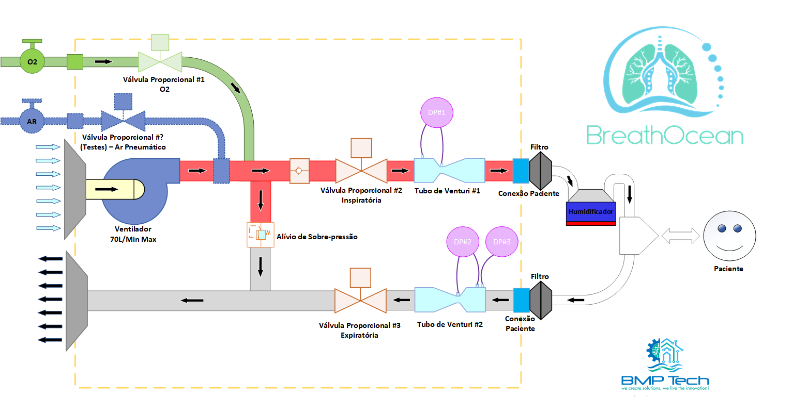

# Breathocean - Ventilador COVID-19

Ventilador pulmonar de baixo custo para ajudar os hospitais na luta contra a covid-19.

Este respirador será baseado em impressão SLS / SLA de produção em massa.

---

# Resumo

O sistema é composto por uma bomba de ar (linhas de ar comprimidos na entrada estão sendo testadas) e um sistema de válvulas controladas eletronicamente.

Este ventilador é capaz de lidar com a respiração controlada por pressão, estabilizada usando um controlador PID no software.

Estamos implementando a respiração controlada por volume e posteriormente a respiração assitida.

---

# Esquemas

## Circuito Pneumático

